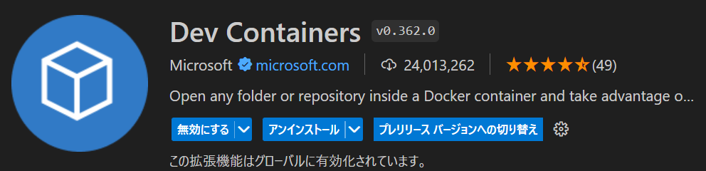
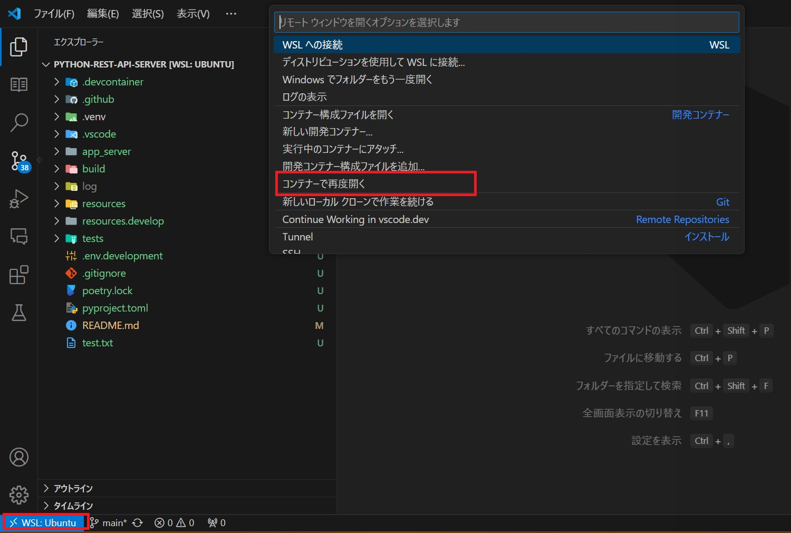

# Next.JSテンプレート

モダンなNext.jsアプリケーション開発のための包括的なテンプレートプロジェクト。

[](https://Next.js.org/)
[](https://www.prisma.io/)
[](https://tanstack.com/query)
[](https://tailwindcss.com/)
[](https://next-auth.js.org/)

## デプロイURL
- 実物を下記URLで確認できます。

[https://nextjs-template-pink-six.vercel.app/](https://nextjs-template-pink-six.vercel.app/)

- ログインはGitHubでログインするかアカウントを適当に作成してください。

## 📚 重要なリンク

- [リリースノート](docs/RELEASE.md)
- [AI活用について](docs/AI活用について.md)
- [認証について](docs/認証について.md)
- [キャッシュとレンダリング](docs/キャッシュとレンダリング.md)
- [Prisma運用手順](docs/Prisma運用手順.md)
- [テストについて](docs/テストについて.md)
- [フォームについて](docs/フォームについて.md)
- [状態管理について](docs/状態管理について.md)
- [ダッシュボードについて](docs/ダッシュボードについて.md)
- [エラーについて](docs/エラーについて.md)

## 🚀 プロジェクトの目的

### 1, プロジェクトテンプレート

このプロジェクトは、社内プロジェクトのテンプレートとして作成しました。新しいプロジェクトを始める際の基盤として、TypeScript + React + Next.js + Prisma + Shadcn/UI + TailwindCSSを利用したベストプラクティスと技術スタックを提供することを目的としています。

- **一貫性のある開発体験**: すべてのプロジェクトで一貫したコード構造とパターンを提供
- **開発の迅速化**: 共通機能が既に実装されているため、新機能の開発に集中できる
- **品質の向上**: テスト済みのコンポーネントとパターンを使用することで、品質を確保

### 2. AIツールとの相乗効果

本テンプレートはAIツールを利用することでより相乗効果を受けやすい技術スタック、コーディング規約を採用しています。

もちろんAIツールなしでも開発は行えますが、AIツールを利用することでより開発効率を向上させることができます。

- TailwindCSS
  - 一つのファイルにスタイリングできるようにすることで、コード補完の恩恵を受けやすいようにする。
- Shadcn/UI
  - 手動でカスタマイズ可能な可能なUIコンポーネントライブラリ
  - すべて `src/components/ui/` に配置されているため、AIでコンポーネントの改造が可能
- knip
  - AIが生成した未使用のコンポーネントを検出・削除するためのツール
- コーディング規約
  - 型情報は1つのファイルで完結するようにするために、なるべく利用するファイルと同じファイルで書く

## 🤝 コントリビューション

このテンプレートは自由に使用していただけます。フォーク、改造も自由です。
また、改善のためのコミットやプルリクエストも歓迎します！

## 🛠️ 技術スタック一覧
| 技術 | バージョン | 概要 |
|------|------------|------|
| React | 19 | フロントエンドのフレームワーク |
| Next.js | 15 | Reactベースのフルスタックフレームワーク。バックエンドコードも書ける |
| TailwindCSS | 4 | ユーティリティファーストのCSSフレームワーク。カスタマイズ性が高く効率的なスタイリングが可能 |
| Prisma | 6 | 型安全なORMツール。データベース操作を直感的に行える |
| Shadcn/UI | 3 | 再利用可能なUIコンポーネントライブラリ |
| NextAuth | 4 | Next.js向け認証ライブラリ。JWTを使った認証やOAuthを利用した認証プロバイダーにも対応 |
| TanStack Query | 5 | サーバーの状態管理ライブラリ。fetchの際のキャッシュやデータの同期を効率的に処理 |
| Zustand | 4 | シンプルで軽量なフロントエンドのステート管理ライブラリ |
| Zod | 3 | 検証ライブラリ |
| Conform | 1 | フォームバリデーションライブラリ |
| Biome | 1 | リンター・フォーマッター |
| Vitest | 2 | JavaScript/TypeScriptテストフレームワーク |
| Playwright | 1 | ブラウザ操作テストフレームワーク |

## 🔍 技術選定の理由

### React

Reactは以下の理由から最適な選択肢です：

- フロントエンドのフレームワークとしてはReactが最も人気がある⇒有志のドキュメントやライブラリが充実している
  - [VueよりReactの方が人気がある](https://npmtrends.com/react-vs-vue)
- JSXという素のJavascriptに近い構文でフロントコードを記述できて学習コストが低い
  - VueはReactと比べて特有の構文が多く学習コストが高いと言われている

### Next.js

中規模プロジェクトにおいて、Next.jsは以下の理由から最適な選択肢です：

- バックエンド、フロントエンドの両方をNext.jsで書くことができる
  - クラサバ間での型の共有化が可能
- （大規模になるとフロントエンドとバックエンドを分離したほうが良い場面が出てくるので、その場合はNext.js以外のフレームワークを選択することをお勧めします）

Next.jsを知っている方は以下のような疑問もあると思います。

- バックエンドとフロントエンドの境界が分かりづらい
- レンダリング・キャッシュの仕組みが複雑で分からない
- バージョンが変わるごとに書き方が変わって今の書き方が分からない

上記のおような疑問を解決するために、以下のようなテンプレートを用意しています。

- 最新のバージョン(Next.js 15)の書き方で一通りサンプル付きで紹介
- レンダリング・キャッシュの仕組みをサンプル付きで紹介
- バックエンドのフロントエンドをベストプラクティスに沿ったフォルダ分けをして境界を明確化

### Prisma
Prismaは現代のORMとして非常に優れており、以下の利点があります：

- **型安全**: TypeScriptとの完全な統合により、型エラーを事前に検出
- **マイグレーション**: スキーマの変更を簡単に管理
- **直感的なAPI**: 複雑なSQLを書かずに、直感的なJavaScriptAPIでデータベースを操作
- **複数のデータベース**: PostgreSQL、MySQL、SQLite、SQL Serverなど、様々なデータベースをサポート
- **スキーマ駆動開発**: データモデルを中心とした開発アプローチ

一方で、Prismaはマイグレーションやデータベース操作の構文などの多少の学習コストがかかるデメリットがあります。

本プロジェクトではPrismaをテンプレート化、ドキュメントを整備しているので、Prismaを初めて使う方でも問題なく利用できるようになっています。

---
### ※ ORMのすすめ
ORM(Object-Relational Mapping)とはPrismaのようなデータベースをオブジェクト指向で操作するためのフレームワークのことです。

バックエンドの開発者でデータベース処理を書く際にORMではなくDBドライバを使って素のSQLを書くことが多い方もいると思います。

しかし、初めてデータベースに触れる方のSQLの理解や、パフォーマンスを出すためなど、素のSQLを書く必要な用途はありますが、個人的には大抵のプロジェクトでは素のSQLで書くよりORMを使った方が開発効率が良いと思っています。

ORMは学習コストが高い面や、言語・フレームワークが替わる度に勉強の必要があるため、苦手意識を持つ方もいらっしゃると思いますが、一度取得できれば開発効率の向上のメリットが大きいです。

（学習コストについては、誰かが最初の使い方をまとめたら、以降の開発者にそこまで学習コストはかからないとも思ってます。）

ORMを使うことで以下のようなメリットがあります。
- 型安全
  - 型安全になることによりIDEの補完が効くようになる ⇒ これが大きい。素のSQLより直感的に素早く書くことができるようになる。
  - フレームワークによってはスキーマからリバースエンジニアリングして型を生成してくれるものもある
- マイグレーション
  - マイグレーションを使うことでデータベースのスキーマを管理することができる
  - 開発途中でスキーマや初期データを変える必要が出てきて開発者間でのやり取りが大変だったことはありませんか？
  - マイグレーション機能を使うことで、コマンド一つで変更を加えたスキーマを適用することができ、開発者間でのスムーズな変更ができるようになります。
---

## 📂 プロジェクト構成

```
.
├── docker                   # Dockerコンテナ設定
│   ├── Dockerfile           # アプリケーションのDockerfile
│   └── db                   # データベース関連
│       ├── Dockerfile       # データベースのDockerfile
│       └── sample.a5er      # データベース設計図
├── docs                     # ドキュメント
│   ├── AI活用について.md    # AI活用について
│   ├── 認証について.md      # 認証について
│   ├── Prisma運用手順.md  # マイグレーションガイド
│   ├── キャッシュとレンダリング.md # キャッシュとレンダリングガイド
│   ├── フォームについて.md # フォームについて
│   ├── 状態管理について.md # 状態管理について
│   ├── ダッシュボードについて.md # ダッシュボードについて
│   ├── エラーについて.md # エラーについて
│   ├── テストについて.md # テストについて
│   └── RELEASE.md           # リリースノート
├── logs                     # ログファイル
├── middleware.ts            # Next.jsミドルウェア設定
├── next.config.ts           # Next.js設定ファイル
├── package.json             # 依存関係とスクリプト
├── prisma                   # Prismaデータベース設定
│   ├── schema.prisma        # データモデル定義
│   └── migrations           # データベースマイグレーション
├── public                   # 静的ファイル
├── src                      # アプリケーションソースコード
├── tailwind.config.ts       # Tailwind CSS設定
├── tests                    # テストファイル
│   ├── e2e                  # ブラウザ操作テスト
│   └── unit                 # ユニットテスト
├── tsconfig.json            # TypeScript設定
└── vitest.config.mts        # Vitestテスト設定
```

## 📂 srcプロジェクト構成

```
src/
├── app/                  # App Router ページとレイアウト
│   ├── api/              # APIエンドポイント（バックエンド処理）
│   ├── dashboard/        # ダッシュボード関連ページ
│   └── providers.tsx     # グローバルプロバイダー
├── components/           # 再利用可能なコンポーネント
│   ├── ui/               # 基本UIコンポーネント
│   └── ...               # 機能別コンポーネント
├── lib/                  # ユーティリティと共有ロジック
│   ├── backend/          # バックエンド関連ロジック
│   │   └── repository/   # データアクセスレイヤー
│   ├── frontend/         # フロントエンド関連ロジック
│   │   ├── repository/   # データアクセスレイヤー
│   │   └── markdown/     # マークダウンヘルプコンテンツ
│   ├── share/            # 共有定数とスキーマ
│   └── utils/            # ユーティリティ関数
└── styles/               # グローバルスタイル
```

## 🌟 主要機能

- **認証システム**: NextAuthを使用したセキュアなユーザー認証
- **ダッシュボード**: 管理画面のテンプレート
- **レンダリングデモ**: Next.jsの各種レンダリング方式の実装例
- **フォーム処理**: Conformとzodを使用した型安全なフォーム
- **データテーブル**: TanStack Tableを使用した高機能テーブルとuseQueryを使用したデータ取得
- **状態管理**: Zustandを使用したグローバル状態管理
- **通知システム**: トースト、アラート、エラーハンドリング、ログ
- **ダークモード**: テーマ切り替え機能

## 🔧 セットアップ

### 前提条件

- WSL2
- Docker Desktop（もしくは代替できるもの）
- VSCode

3点のインストールと最低限の設定は必要です。

各自インストールしてください。

### インストール
---

1. クローンする。クローン先はWSL2上のフォルダに展開する（WIndows上フォルダでも可だが、それだとファイルの読み込み速度が20倍ほど違う。。）
2. ローカルでVSCodeを開き、Extensionsから【Remote Development】をinstallする



3. プロジェクトのルートディレクトリでVsCodeを開き、左下のマークから「コンテナを再度開く」を選択する。



4. `.env.example` をコピーして `.env` を作成する。(データベースはコンテナでデフォルトで立ち上がってるので、データベースの設定の変更は不要です)

5. データベースのマイグレーションを実行する。
  ```bash
  pnpm run prisma:migrate:dev
  ```

6. 開発サーバーを起動する。
  ```bash
  pnpm run dev
  ```

7. ブラウザで [http://localhost:3000](http://localhost:3000) にアクセスして、プロジェクトが正常に起動していることを確認する。


## 💻 開発ガイド

### コーディング規約

強制力はありませんが、以下のようなコーディング規約を守ることで、より良いコード品質を保つことができます。

- コードの品質を維持するためにBiome（リンター、フォーマッター）を使用
- コンポーネントはなるべく小さく、再利用可能に設計
- 状態管理は適切なスコープで行う（ローカル vs グローバル）
- 型情報は1つのファイルで完結するようにするために、なるべく利用するファイルと同じファイルで書く

### ブランチ戦略

- `main`: 本番環境用ブランチ
- `develop`: 開発環境用ブランチ
- `feature/yyyymmdd/feature-name`: 新機能開発用ブランチ
- `bugfix/yyyymmdd/bug-name`: バグ修正用ブランチ

### コミットメッセージ

コミットメッセージは以下の形式に従ってください：

```
<subject>

<body>
```

例：
```
ユーザー登録機能の追加

- メールアドレスとパスワードによる登録フォームを実装
- 確認メール送信機能を追加
- ユーザーテーブルのマイグレーションを追加
```

## 🤝 貢献方法

1. 新しいブランチを作成 (`git checkout -b feature/yyyymmdd/feature-name`)
2. 変更をコミット (`git commit -m '素晴らしい機能を追加'`)
3. ブランチにプッシュ (`git push origin feature/yyyymmdd/feature-name`)
4. プルリクエストを作成

## 📄 ライセンス

このプロジェクトは [MIT License](LICENSE) の下で公開されています。

---
