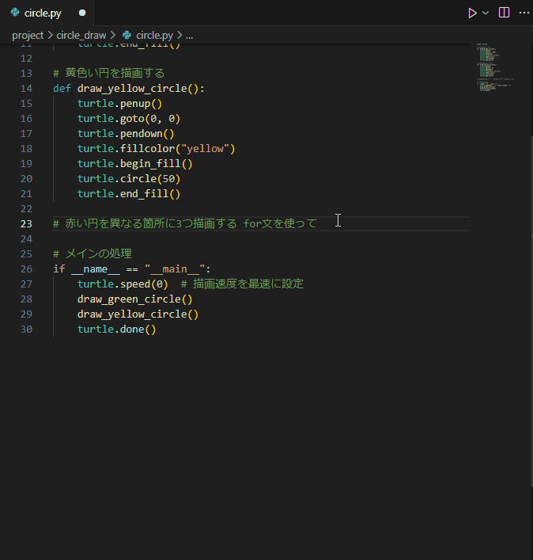

# プロジェクト開発におけるAI活用について

## プロジェクト開発でのAIツール
2023年11月にChatGPTが発表されてから、AIツールは著しく発展してきました。

プロジェクト開発においても、様々なAIツールが発表されています:

| 機能/特徴 | [Devin](https://devin.ai/) | [Cursor](https://www.cursor.com/) | [GitHub Copilot](https://github.com/features/copilot) |
| - | - | - | - |
| プラットフォーム | GitHub/Slackベース | IDEベース | 主要なIDE内で動作 |
| 設計アプローチ | リモートファースト | ローカルファースト | インラインリアルタイム |
| 作業スタイル | 自律的、タスク全体を実行 | インクリメンタル、対話的 | リアルタイムのインライン提案 |
| コンテキスト理解 | プロジェクト全体の理解が必要、明示的な指示が必要 | 自動的にコンテキストを維持、関連ファイルを検出 | 開いているファイルに基づく限定的なコンテキスト |
| ユーザーコントロール | より自律的、大きな変更を自動的に実行 | 段階的な変更、確認を求める | 提案を選択する必要あり |
| 最適な用途 | 完全な機能開発、PRの作成 | 既存のワークフローへのAI統合 | クイックなコード補完、小規模な支援 |
| 特徴的な長所 | 自律的なタスク実行、PRの作成能力 | VSCodeライクな環境、強力なAIチャット | 広範なIDE対応、低コスト |
| 特徴的な短所 | 高コスト、誤解釈のリスク | オフラインでの制約 | 複雑なタスクには不向き |

| 機能/特徴 | [Cline](https://cline.google/) |
| - | - |
| プラットフォーム | ターミナルベース、コマンドラインインターフェース、VSCodeの拡張機能 |
| 設計アプローチ | コマンドラインツールとしてのAI支援 |
| 作業スタイル | ターミナル内での対話式、コマンド生成と実行支援 |
| コンテキスト理解 | 現在のディレクトリ構造とコマンド履歴を理解 |
| ユーザーコントロール | 提案されたコマンドを確認してから実行可能 |
| 最適な用途 | 複雑なコマンド生成、シェルスクリプト作成、開発者ワークフロー効率化 |
| 特徴的な長所 | ターミナル内での自然言語からコマンド変換、シームレスな統合 |
| 特徴的な短所 | ターミナル環境に限定、GUIタスクには不向き |

- [AIエージェント「Devin」はジュニアエンジニアの域を超えていた](https://forest.watch.impress.co.jp/docs/serial/aidev/1671331.html)
- [次世代のエディター Cursor(カーソル) を使いこなす](https://qiita.com/kota33/items/20a884cbd969cf1ce087)
- [GitHub Copilotとは？](https://zenn.dev/umi_mori/books/ai-native-programming/viewer/what_is_github_copilot)
- [CLINEに全部賭けろ](https://zenn.dev/mizchi/articles/all-in-on-cline)

## なぜAIツールを利用するのか
AI生成されたコードはばっと見だと、ある程度のコーディング経験のある人ぐらいのコードが一瞬で生成されます。

AIツールを利用してみて、1日かけていた課題をチャット次第で数分で解決する、ということもあります。

また、一般的な会話生成AIモデルを利用してもコードは生成できますが、GitHub CopilotやCursorなどのコーディングに特化したAIツールを使うと、単にチャットで質問するより、精度がよく文脈に沿った良いコードが生成されるように感じます。

その理由は下記のようなプロジェクトに最適化された工夫があるためです。

- プロジェクトを理解した上で、プロジェクトのコードに沿ったコードを生成する
- コード生成に特化したプロンプトエンジニアリングでの最適化
  - [CoT(Chain of Thought)](https://www.promptingguide.ai/jp/techniques/cot)
  - [ReAct](https://www.promptingguide.ai/jp/techniques/react)
  - [RAG](https://www.promptingguide.ai/jp/techniques/rag)
- Web検索機能などのAIエージェントの利用 [※CursorのWeb検索機能](https://www.cursor.com/ja/features)
- IDEのエラーやリントなどの出力と連携して、コードを最適化する。

また個人的にはAI補完も強力です。

CursorやGitHub Copilotでは、コード行にフォーカスを充てると、そのコード行に沿ったコードを補完してくれます。
今までもVSCodeのようなリッチなIDEでは、関数名や変数名などの補完をやってくれていましたが、CursorやGitHub Copilotでは、よりコードの文脈に沿ったユーザフィットな補完をしてくれます。

**コード補完の様子**

AIツールは自然言語を理解できて、汎用的使い方できるため、ドキュメントやコードテンプレート、また、Webに情報さえ載っていれば、人は指示を出すだけで、AIが開発を行ってくれます。

### **プロジェクト開発においてAIは必須のツールになりました。**

開発においてAIを利用するかしないかで3～10倍程度、効率に違いがあると思っています。

自然言語で指示ができ、汎用的に背景を理解できるため、誰がどのように使っても効果を実感できます。

コードの学習にも使えるし、プロジェクトの仕様書も作れるし、コーディング補助もできるし、リプレイス作業など何でも利用できます。

AIツールは業務を効率化するものであって、導入したからといって複雑化するものでもありません。

気軽に使ってみてください。
