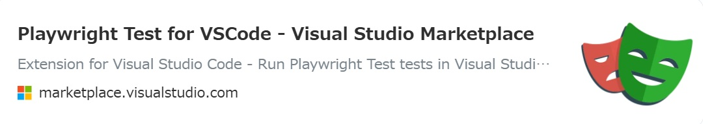
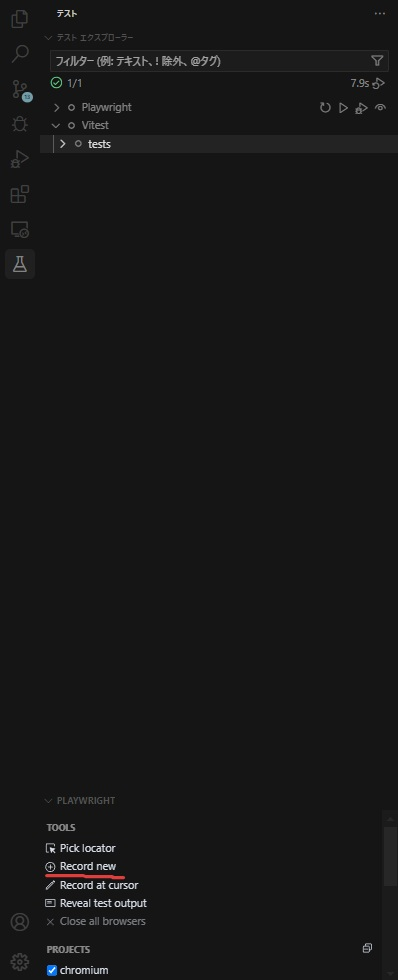
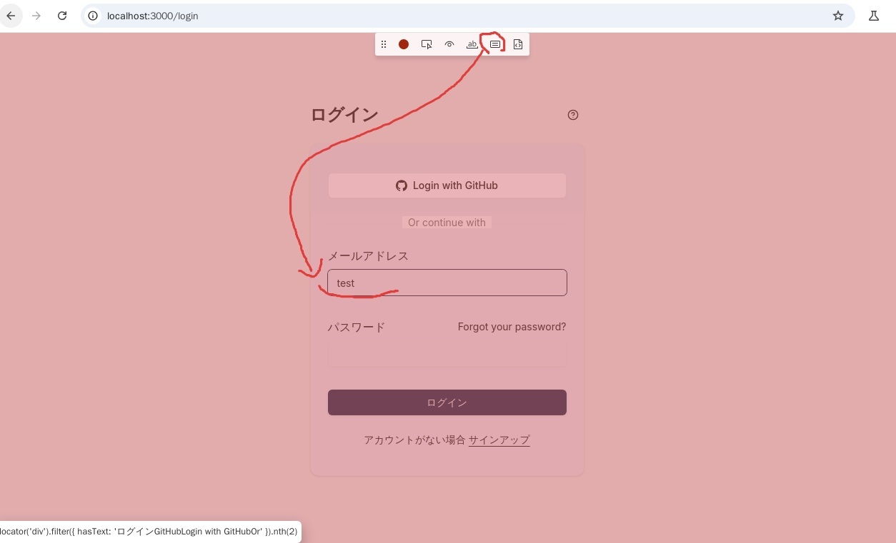

# テストについて

## 単体テストとE2Eテストの概要

本プロジェクトでは、以下の2種類のテストを実装しています：

- 単体テスト: Vitestを使用
- E2Eテスト: Playwrightを使用

### なぜE2Eテストが必要か

単体テストだけでは以下の点で不十分です：

- 実際のユーザー操作の流れを検証できない
- コンポーネント間の連携や統合的な動作を確認できない
- ブラウザ固有の動作や実際の画面表示を確認できない

E2Eテストを併用することで：

- GUIでのテストができる
- スクショ・動画を撮ることができる
- VSCodeの拡張機能を利用することで単体テストを書くより簡単に書ける ⇒ メリットとして大きい

## Vitestについて

Vitestは高速な実行速度を特徴とするJavaScript用のテストフレームワークです。
Jest互換のAPIを提供しながら、Viteのエコシステムを活用できます。

### 設定

`vitest.config.mts`での主な設定：

```typescript
export default defineConfig({
  plugins: [tsconfigPaths(), react()],
  test: {
    environment: 'jsdom',
    include: ['tests/unit/**/*.{test,spec}.{js,mjs,cjs,ts,mts,cts,jsx,tsx}'],
  },
})
```

- `jsdom`環境を使用してブラウザAPIを利用できるようにする
- `tests/unit`ディレクトリ配下のテストファイルを対象
- TypeScriptのパスエイリアスをサポート

## 実行

```bash
pnpm run test:unit
```

### 実装例

`tests/unit/example.test.ts`に基本的なテストを実装しています：

```typescript
describe('テストスイート', () => {
  it('数値の加算が正しく動作すること', () => {
    expect(1 + 1).toBe(2)
  })

  it('非同期処理が正しく動作すること', async () => {
    const result = await new Promise((resolve) => {
      setTimeout(() => resolve('非同期処理の結果'), 1000)
    })
    expect(result).toBe('非同期処理の結果')
  })
})
```

## Playwrightについて

Playwrightは、モダンなWeb向けのE2Eテストフレームワークです。

### 設定

`playwright.config.ts`での主な設定：

```typescript
export default defineConfig({
 testDir: './tests/e2e',
 /* テストファイルを並列実行する */
 fullyParallel: true,
 /* CIで test.only が残っていた場合にビルドを失敗させる */
 forbidOnly: !!process.env.CI,
 /* CIでのみリトライを実行 */
 retries: process.env.CI ? 2 : 0,
 /* CIでは並列テストを無効化 */
 workers: process.env.CI ? 1 : undefined,
 /* 使用するレポーター。詳細: https://playwright.dev/docs/test-reporters */
 reporter: 'html',
 /* すべてのプロジェクトで共有される設定。詳細: https://playwright.dev/docs/api/class-testoptions */
 use: {
  /* アクションで使用するベースURL。例: await page.goto('/') */
  baseURL: 'http://127.0.0.1:3000',
  // ブラウザを表示するか
  // headless: false,
  /* 失敗したテストを再試行する際にトレースを収集。詳細: https://playwright.dev/docs/trace-viewer */
  trace: 'on-first-retry',
 },
    ...
})
```

### セットアップ

1. 下記のコマンドでchroniumなどのブラウザと依存関係をインストール

```bash
pnpm exec playwright install
pnpm exec playwright install-deps    
```

2. ブラウザを表示する場合は`headless: false`を設定

```typescript
// playwright.config.ts
export default defineConfig({
 use: {
  /* アクションで使用するベースURL。例: await page.goto('/') */
  baseURL: 'http://127.0.0.1:3000',
  // ブラウザを表示するか
  // headless: false,
  /* 失敗したテストを再試行する際にトレースを収集。詳細: https://playwright.dev/docs/trace-viewer */
  trace: 'on-first-retry',
 },
})
```

### 実行

```bash
pnpm run test:e2e
```

### 実装例

`tests/e2e/example.spec.ts`に基本的なテストを実装しています：

```typescript
async function login(page: Page) {
  await page.getByPlaceholder('example@example.com').click()
  await page.getByPlaceholder('example@example.com').fill('test@test.com')
  await page.getByLabel('パスワード').click()
  await page.getByLabel('パスワード').fill('test@test.com')
  await page.getByRole('button', { name: 'ログイン' }).click()
}

test('ログイン', async ({ page }) => {
  await page.goto('/')
  await login(page)
  // スクリーンショットの取得
  await page.screenshot({
    path: getScreenshotFilePath(),
    fullPage: true,
  })
})

// 認証後の処理関連
test.describe('認証後の処理関連', () => {
 test.beforeEach(async ({ page }) => {
  await page.goto('/')
  await login(page)
 })

 test('フォーム', async ({ page }) => {
  await page.getByRole('link', { name: 'Forms' }).click()
  await page.getByPlaceholder('John Doe').click()
  await page.getByPlaceholder('John Doe').fill('John Doe')
  await page
   .locator('form')
   .filter({ hasText: 'NameSubmit' })
   .getByRole('button')
   .click()
  await expect(page.getByRole('paragraph')).toContainText(
   'フォームの送信が完了しました！',
  )
  // fullサイズで画面をスクショ
  process.env.CI ||
   (await page.screenshot({
    path: getScreenshotFilePath(),
    fullPage: true,
   }))
 })
})
```

## 【おすすめ】 VSCode拡張機能を使用したPlaywrightテストの作成

VSCodeの拡張機能「Playwright Test for VSCode」を使用することで、ブラウザで画面操作しながらテストコードを生成できます。



画面を操作しながらコードが生成されるので、神速でテストコードが書けます。

### 手順

1. VSCodeマーケットプレイスから「Playwright Test for VSCode」をインストール
2. コマンドパレットから「Record new test」を選択



3. ブラウザが表示されるので、テストしたい画面を開く
4. 各種操作をすると、テストコードが生成されます。「Assert Value」などをクリックして検証する項目も生成できます。

```typescript
// 自動で作成されたテストコード
test('test', async ({ page }) => {
  await page.getByPlaceholder('example@example.com').click();
  await page.getByPlaceholder('example@example.com').fill('test');
  await expect(page.getByPlaceholder('example@example.com')).toHaveValue('test');
});
```



5. 必要に応じてスクリーンショットを作成します。

```typescript
// 自動で作成されたテストコード
test('test', async ({ page }) => {
  await page.getByPlaceholder('example@example.com').click();
  await page.getByPlaceholder('example@example.com').fill('test');
  await expect(page.getByPlaceholder('example@example.com')).toHaveValue('test');
  // スクリーンショットを作成
  await page.screenshot({
    path: getScreenshotFilePath(),
    fullPage: true,
  });
});
```
